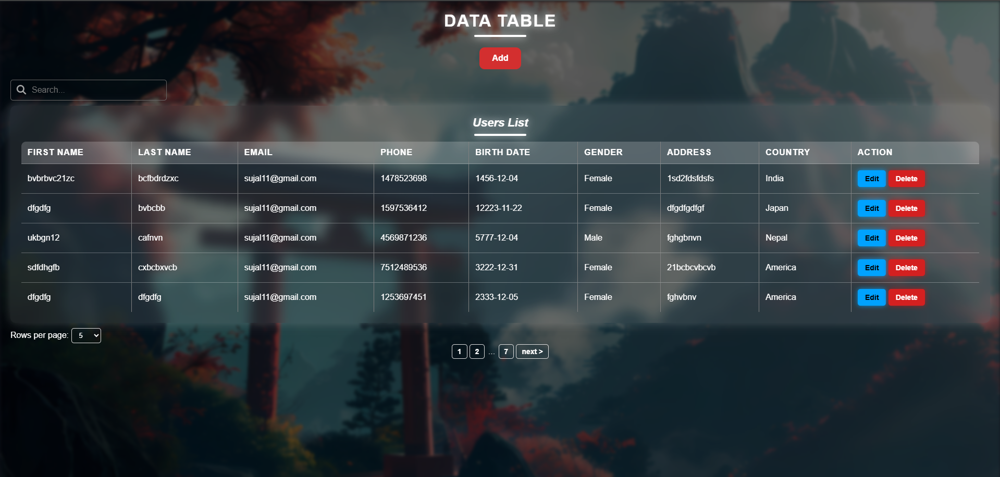
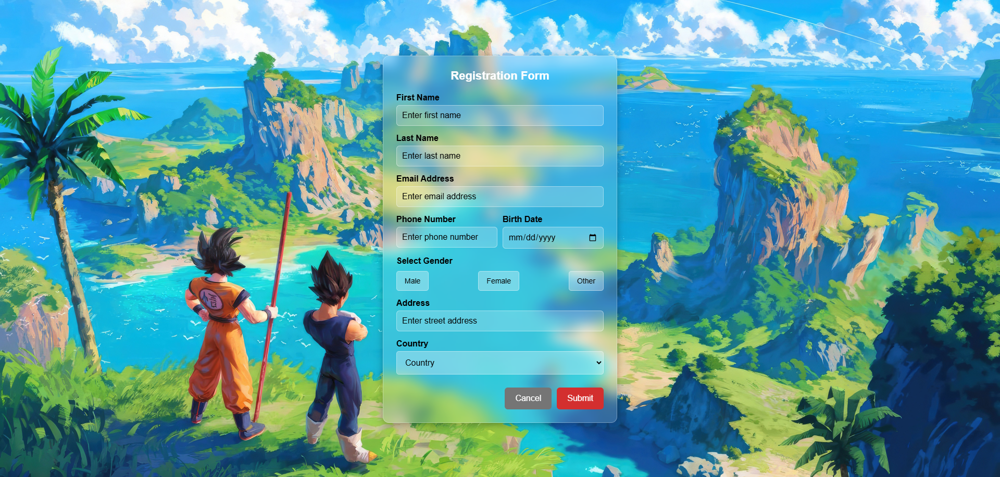

<h1 align="center">👋 Welcome ! To JavaScript CRUD Application !</h1>

✨💻📚 This project is specifically designed for learning the fundamental concepts of JavaScript, HTML, and CSS operations. 📚💻✨

---

## 📝 Registration Form 🖊️

📌 This **intuitive registration form** allows users to sign up effortlessly with a smooth and **user-friendly** experience.👨‍💻

💡 A simple and efficient <strong>CRUD (Create, Read, Update, Delete) application</strong> built using <strong>JavaScript, HTML, and CSS</strong> to streamline data management with ease. 💡

---

## 🚧 Current Status:-

⚙️ Ongoing Enhancements & Bug Fixes 🛠️

🔧 Currently, only one minor bug exists. 🐞 The application is actively being improved for better functionality. 💬

---

## ✨Key Features :-

- ➕ Effortlessly **add new** records **dynamically**.

- ✏️ **Edit Modify** existing entries with ease.

- 🗑️ **Delete records** with a **Delete Modul** and **confirmation Notifications**

- 💾 Persistent **data storage** using **LocalStorage** for seamless access.

- 📱 Fully **responsive** design for a smooth experience across devices.

- 💬 Real-time **notifications** for key actions.

- ✔️ Input **validation** to ensure data accuracy.

---

## 🛠️ How to Use :-

- 📂 Open the application in your browser.

- 📝 click **'Add'** to add a new record and Enter details in the input fields **click 'Submit' to save** a new record

- ❌ Click **'Cancel'** to **return to the home page** without making changes.

- ✅ Click **'Submit'** to **confirm and store** the data securely.

- ✏️ Click **'Edit'** to **update** an existing entry.

- 🗑️ Click **'Delete'** to **remove** an entry permanently.

---

### 📸 Screenshots :-

✨ Explore the key sections of the application below! **Click on any image for a closer look.** ✨

### 🔍 Click on images to view them in full size!

## 🏠 Home Page :-

🖥️ A clean and professional **homepage** with intuitive navigation.

<p align="center">  </p>

## ➕ Add New Record :-

📋 **Easily add new records** with a user-friendly form.

<p align="center">  </p>

## 🗑️ Delete Confirmation Modal :-

⚠️ A **confirmation popup** ensuring safe **deletions**.

<p align="center">  </p>

### 📂 More Screenshots: [Click Here View Gallery](Screenshots)

---

## 📦 Installation & Setup 📦

- 🛠️ To set up the **project** on your **local machine**, follow these **steps:**

```bash
# 1️⃣ Clone the repository:-
git clone https://github.com/sujal1130/javascript-crud.git
```

```bash
# 2️⃣ Navigate to the project directory:-
cd javascript-crud
```

```bash
# 3️⃣ Open index.html your preferred browser.
```

---

## 🏗️ Technologies Used :-

<!-- Table -->
<table border="1" align="center">
  <tr>
    <th>Technology</th>
    <th>Badge</th>
    <th>Description</th>
    <th>Img</th>
    <th>Gif</th>
  </tr>
  <tr>
    <td align="center"><b>CSS3</b></td>
    <td align="center">
      
    </td>
    <td align="center">Stylish and responsive UI design.</td>
    <td rowspan="3" align="center">
      
    </td>
    <td rowspan="3" align="center">
      
    </td>
  </tr>
  <tr>
    <td align="center"><b>HTML5</b></td>
    <td align="center">
      
    </td>
    <td align="center">Structured and semantic web content.</td>
  </tr>
  <tr>
    <td align="center"><b>JavaScript</b></td>
    <td align="center">
      
    </td>
    <td align="center">Dynamic and interactive functionality.</td>
  </tr>
</table>
<!-- Footer Message -->
<p align="center">
  🚀 <strong>Happy Coding! 👨‍💻✨ Keep building awesome projects and pushing boundaries!</strong> 🔥💡
</p>

---

